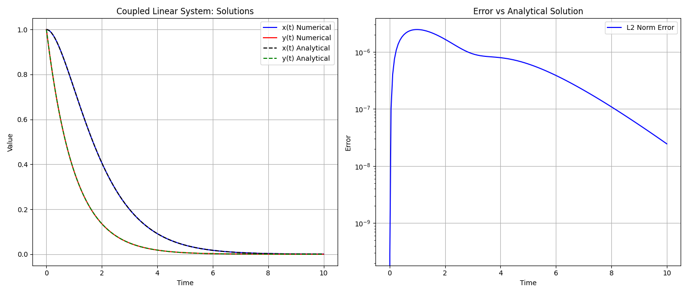

# Numerical ODE Solver with Butcher Tableaus

This repository contains a robust and flexible Python package for solving **ordinary differential equations (ODEs)**.  
The solver is built to handle both **explicit and implicit Runge–Kutta methods** using a powerful **Butcher tableau** approach, and it includes a **numerical Jacobian** for convenience.

---

## Features

- **Butcher Tableau-based Solver**:  
  A general-purpose Runge–Kutta solver configurable with any Butcher tableau. Supports a wide range of methods, from classic RK4 to advanced implicit SDIRK schemes.

- **Adaptive Time-Stepping**: 
  The solver automatically adjusts the time step size based on    local error estimates, ensuring that a solution is found with the specified accuracy while minimizing computational effort. This is crucial for solving problems with dynamics that change over time

- **Implicit Method Support**:  
  Uses the **Newton–Raphson method** to solve the nonlinear systems that arise in implicit ODEs, making it suitable for stiff problems.

- **Flexible System Definition**:  
  Define any ODE system by inheriting from the `EDOs` abstract class. A fallback **numerical Jacobian** (central finite differences) is provided automatically.

- **Analytical Jacobian Overrides**:  
  For improved performance and accuracy, users can override the default numerical Jacobian with a hand-derived one.

- **Example Systems Included**:
  - **Lorenz System**: Demonstrates handling of chaotic dynamics and generates the famous butterfly attractor.  
  - **Simple Linear System**: With a known analytical solution, perfect for accuracy testing.
  - **Robertson**: A classic stiff problem that showcases the power of implicit solvers..
---

## Getting Started

### Prerequisites

You will need **Python** and the following packages:

- `numpy`  
- `scipy`  
- `matplotlib` (for visualization)

### Installation

Clone the repository and install the package in "editable" mode:


```bash
git clone https://github.com/itchinda/pyodys-project.git
cd pyodys-project
pip install -e .

```

The `-e` flag allows you to run the package from any directory while still being able to edit the source code.

## Usage

### Listing Available Schemes

You can list all the available Runge-Kutta schemes directly from the command line:

```bash
python -m pyodys --list-schemes
```

### Running a Quick Example

To solve the Lorenz System with a simple command, you can use one of the provided examples The script will automatically handle the initial conditions and visualization.

```bash
python -m examples/lorenz_system.py --method dopri5 --final-time 50.0
```

You can customize the simulation by changing parameters like the method (`--method`), final time (`--final-time`), step size (`--step-size`), and tolerance (`--tolerance`).

## Code Example: Coupled Linear System

This example solves the coupled system:

$$ x'(t) = -x(t) + y(t),$$
$$ y'(t) = -y(t), $$
with $$ x(0) = 1, y(0) = 1, $$

using **RK4** solver, and plot the solution:

$$x(t) = e^{-t}  (1 + t),  $$
$$y(t) = e^{-t}$$

---

```python
import numpy as np
import matplotlib.pyplot as plt

# Using the top-level imports from the installed package
from pyodys import EDOs
from pyodys import TableauDeButcher
from pyodys import SolveurRKAvecTableauDeButcher

# Define coupled linear system
class CoupledLinearSystem(EDOs):
    def __init__(self, t_init, t_final, u_init):
        super().__init__(t_init, t_final, u_init)
    
    def evalue(self, t, u):
        x, y = u
        return np.array([-x + y, -y])

# Analytical solution
def solution_analytique(t, u0):
    tau = t - 0.0
    x0, y0 = u0
    x = np.exp(-tau) * (x0 + y0 * tau)
    y = y0 * np.exp(-tau)
    return np.array([x, y])

if __name__ == '__main__':
    # Initial conditions
    t_init = 0.0
    t_final = 10.0
    u_init = [1.0, 1.0]
    ode_system = CoupledLinearSystem(t_init, t_final, u_init)

    # Use a SDIRK solver for demonstration
    solver_sdirk = SolveurRKAvecTableauDeButcher(tableau_de_butcher = TableauDeButcher.from_name('sdirk_hairer_norsett_wanner_45'),
                                                 initial_step_size = 0.01,
                                                 adaptive_time_stepping=True,
                                                 min_step_size=1e-6,
                                                 max_step_size=1.0,
                                                 target_relative_error=1e-6)
    times, solutions = solver_sdirk.solve( ode_system )

    # Compute analytical solution and errors
    analytical_solutions = np.array([solution_analytique(t, u_init) for t in times])
    error = np.linalg.norm(solutions - analytical_solutions, axis=1)

    # Plot solutions and errors
    fig, (ax1, ax2) = plt.subplots(1, 2, figsize=(14, 6))

    ax1.plot(times, solutions[:, 0], 'b-', label='x(t) Numerical')
    ax1.plot(times, solutions[:, 1], 'r-', label='y(t) Numerical')
    ax1.plot(times, analytical_solutions[:, 0], 'k--', label='x(t) Analytical')
    ax1.plot(times, analytical_solutions[:, 1], 'r-.', label='y(t) Analytical')
    ax1.set_title("Coupled Linear System: Solutions")
    ax1.set_xlabel("Time")
    ax1.set_ylabel("Value")
    ax1.legend()
    ax1.grid(True)

    ax2.plot(times, error, 'b-', label='L2 Norm Error')
    ax2.set_yscale('log')
    ax2.set_title("Error vs Analytical Solution")
    ax2.set_xlabel("Time")
    ax2.set_ylabel("Error")
    ax2.legend()
    ax2.grid(True)

    plt.tight_layout()
    plt.show()

```

