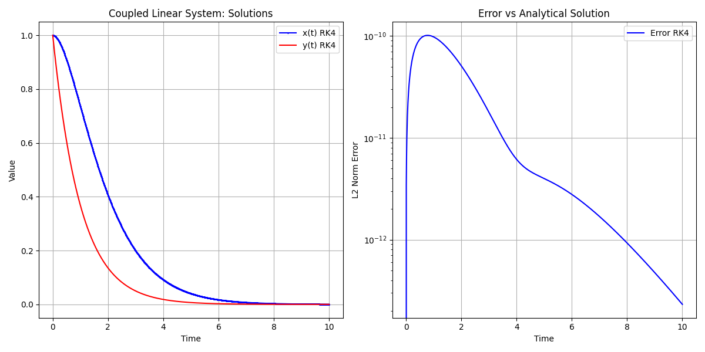

# Numerical ODE Solver with Butcher Tableaus

███████╗ ██████╗   ██████╗ 
██╔════╝ ██╔═══██ ██╔═══██╗
█████╗   ██║   ██ ██║   ██║
██╔══╝   ██║   ██ ██║   ██║
███████╗ ██████╔╝ ╚██████╔╝
╚══════╝ ╚═════╝  ╚═════╝ 

This repository contains a robust and flexible Python package for solving **ordinary differential equations (ODEs)**.  
The solver is built to handle both **explicit and implicit Runge–Kutta methods** using a powerful **Butcher tableau** approach, and it includes a **numerical Jacobian** for convenience.

---

## Features

- **Butcher Tableau-based Solver**:  
  A general-purpose Runge–Kutta solver configurable with any Butcher tableau. Supports a wide range of methods, from classic RK4 to advanced implicit SDIRK schemes.

- **Implicit Method Support**:  
  Uses the Newton–Raphson method to solve the nonlinear systems that arise in implicit ODEs, making it suitable for stiff problems.

- **Flexible System Definition**:  
  Define any ODE system by inheriting from the `EDOs` abstract class. A fallback numerical Jacobian (central finite differences) is provided automatically.

- **Analytical Jacobian Overrides**:  
  For improved performance and accuracy, users can override the default numerical Jacobian with a hand-derived one (e.g., for the Lorenz system).

- **Example Systems Included**:
  - **Lorenz System**: Demonstrates handling of chaotic dynamics and generates the famous butterfly attractor.  
  - **Simple Linear System**: With a known analytical solution, perfect for accuracy testing.

---

## Getting Started

### Prerequisites

You will need **Python** and the following packages:

- `numpy`  
- `scipy`  
- `matplotlib` (for visualization)

Install them with:

```bash
pip install numpy scipy matplotlib

```
## Quick Example: Coupled Linear System

This example solves the coupled system:

$$ x'(t) = -x(t) + y(t),$$
$$ y'(t) = -y(t), $$
with $$ x(0) = 1, y(0) = 1, $$

using **RK4** solver, and plot the solution:

$$x(t) = e^{-t}  (1 + t),  $$
$$y(t) = e^{-t}$$

---

```python
import numpy as np
import matplotlib.pyplot as plt
from systemes.EDOs import EDOs
from solveurs.runge_kutta.TableauDeButcher import TableauDeButcher
from solveurs.runge_kutta.SolveurRKAvecTableauDeButcher import SolveurRKAvecTableauDeButcher

# Define coupled linear system
class SystemeCouple(EDOs):
    def __init__(self, temps_initial, condition_initiale):
        super().__init__(temps_initial, condition_initiale)
    def evalue(self, t, u):
        x, y = u
        return np.array([-x + y, -y])

# Analytical solution
def solution_analytique(t, t0, u0):
    x0, y0 = u0
    tau = t - t0
    x = np.exp(-tau)*(x0 + y0*tau)
    y = y0 * np.exp(-tau)
    return np.array([x, y])

# Initial conditions
t0 = 0.0
u0 = [1.0, 1.0]
systeme = SystemeCouple(t0, u0)

# RK4 solver
solveur_rk4 = SolveurRKAvecTableauDeButcher(TableauDeButcher.from_name('rk4'))
t_rk4, sol_rk4 = solveur_rk4.solve(systeme, pas_de_temps=0.01, nb_pas_de_temps_max=1000)

# Compute analytical solution
sol_ana = np.array([solution_analytique(ti, t0, u0) for ti in t_rk4])

# Compute errors
err_rk4 = np.linalg.norm(sol_rk4 - sol_ana, axis=1)

# Plot solutions
plt.figure(figsize=(12,6))

plt.subplot(1,2,1)
plt.plot(t_rk4, sol_rk4[:,0], 'b.-', markersize=2, label='x(t) RK4')
plt.plot(t_rk4, sol_rk4[:,1], 'r-', markersize=2, label='y(t) RK4')
plt.title("Coupled Linear System: Solutions")
plt.xlabel("Time")
plt.ylabel("Value")
plt.legend()
plt.grid(True)

plt.subplot(1,2,2)
plt.plot(t_rk4, err_rk4, 'b-', label='Error RK4')
plt.yscale('log')
plt.title("Error vs Analytical Solution")
plt.xlabel("Time")
plt.ylabel("L2 Norm Error")
plt.legend()
plt.grid(True)

plt.tight_layout()

plt.savefig("quick_example.png")

plt.show()

```

